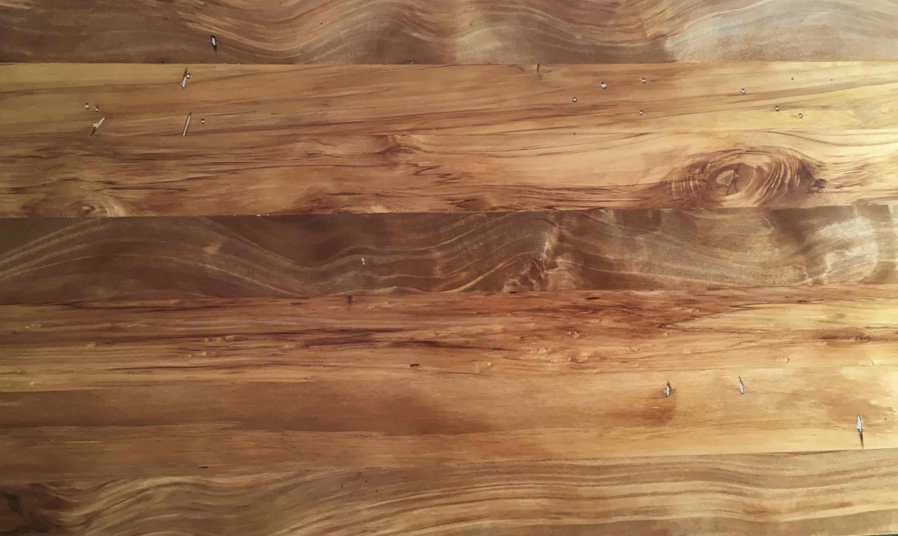
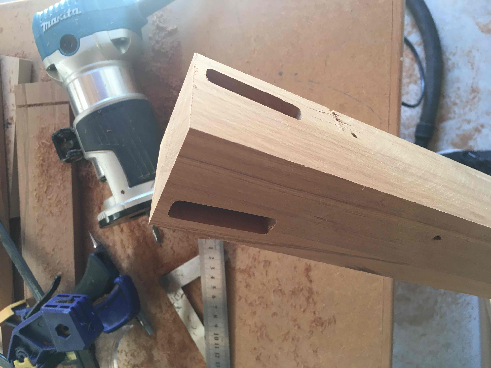
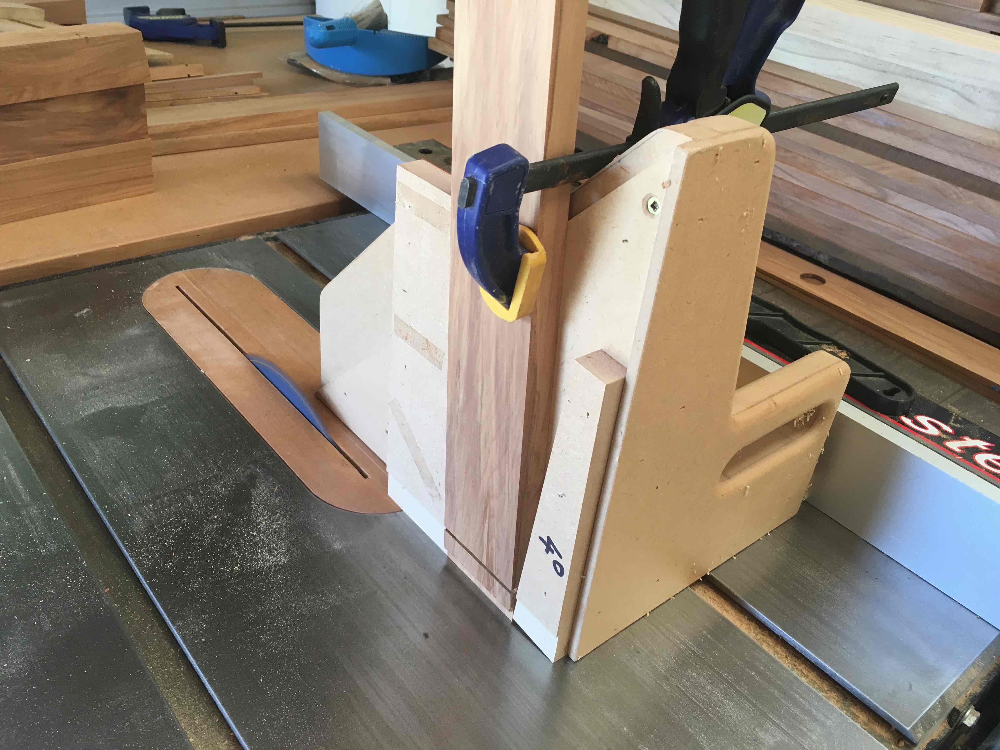
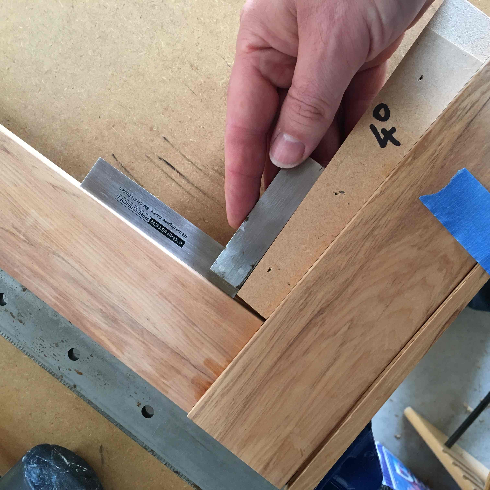
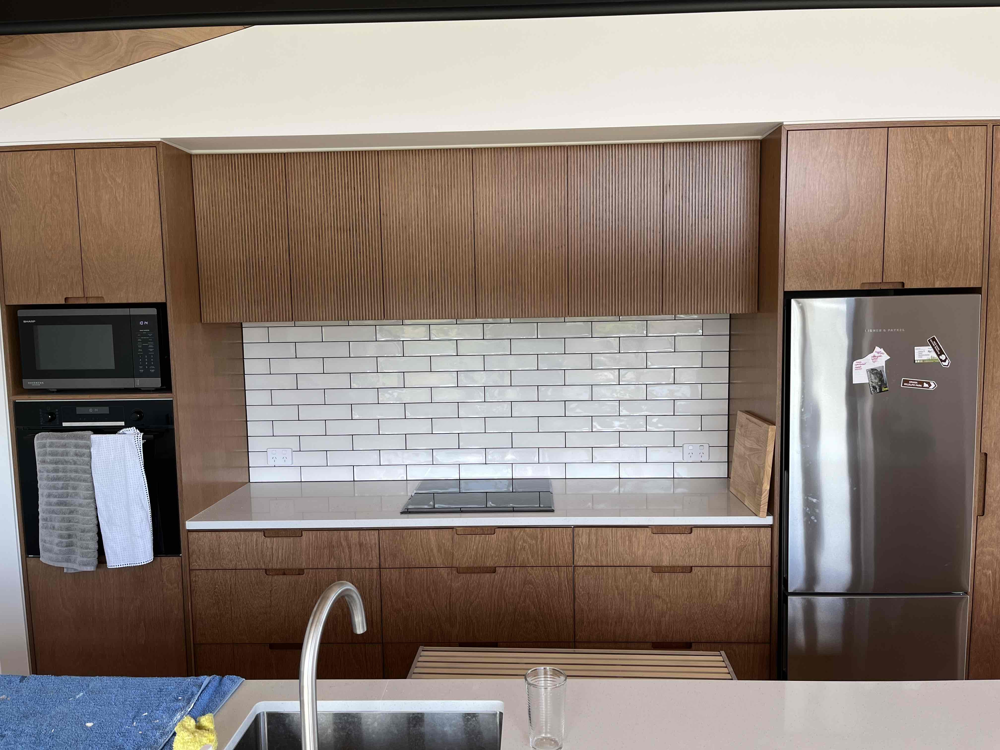
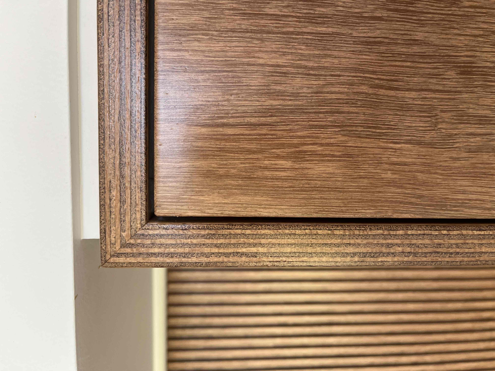

```{css}
/*| echo: false */

div.sourceCode {
  font-size: 1em;
}

div.cell-output-stdout {
  font-size: 1em;
}
```

```{r}
#| echo: false

library(tidyverse)
theme_set(theme_gray(base_size=16))
```


[https://www.rnz.co.nz/news/country/560252/gap-between-people-and-sheep-rapidly-closing](https://www.rnz.co.nz/news/country/560252/gap-between-people-and-sheep-rapidly-closing)

## Data for today

```{r}
library(tidyverse)

ag_production <- read_csv("https://www.massey.ac.nz/~jcmarsha/data/nz/ag_production.csv")
ag_production
```

## Data for today

```{r}
#| message: false

population <- read_csv("https://www.massey.ac.nz/~jcmarsha/data/nz/nz_population.csv")
population
```

##

```{r sheep_vs_humans_final}
#| echo: false
#| fig.width: 16
#| fig.height: 9
ag_production |>
  left_join(population, by=join_by(year)) |>
  filter(animal == "Sheep",
         !is.na(population)) |>
  mutate(ratio = value/population) |>
  ggplot() +
  aes(x=year, y=ratio) +
  geom_line(col = "purple", linewidth=2) +
  geom_hline(yintercept = 1, linewidth=1, linetype='dotted', col='grey40') +
  annotate(geom='text', x=1935, y=1, label='1 sheep per person', vjust=-0.3, col='grey40', hjust=0) +
  scale_y_continuous(limits = \(y) range(y, 1)) +
  labs(x = NULL,
       y = "Sheep per person",
       title = "Gap between people and sheep rapidly closing") +
  theme_minimal(base_size=32)
```

# Telling a story

## {background-image="figures/shavings.jpg" background-opacity=0.5}

{.fragment .absolute top=150 left=0 width="720"}

{.fragment .absolute top=0 left=900 width="380"}
{.fragment .absolute bottom=0 left=340 width="600"}

{.fragment .absolute left=370 top=50 width="540"}
{.fragment .absolute left=160 top=50 width="960"}
{.fragment .absolute right=0 top=0 width="480"}

## What is a story?

[A story is a collection of facts, observations or events&nbsp;]{.fragment}[ presented in a specific order&nbsp;]{.fragment}[ such that they create an **emotional reaction**.]{.fragment}

## Every story has an arc

:::{.fragment}
Opening
:::

:::{.fragment}
Challenge
:::

:::{.fragment}
Action
:::

:::{.fragment}
Resolution
:::

:::{.fragment}
<small>Challenge and resolution are the most important parts.</small>
:::

## Wood working as a story

::: {.fragment}
**Opening:** We used to have some cheap poorly built furniture.
:::

::: {.fragment}
**Challenge:** Buying well built furniture that we like is expensive.
:::

::: {.fragment}
**Action:** I buy some ~~toys~~ tools and learn to build things out of nice timber.
:::

::: {.fragment}
**Resolution:** We still buy cheap, poorly built furniture until I get round to it.
:::

## Other story structures (the action movie)

:::{.fragment}
Action
:::

:::{.fragment}
Background
:::

:::{.fragment}
Development
:::

:::{.fragment}
Climax
:::

:::{.fragment}
Ending
:::

## Woodworking in this format

:::{.fragment}
**Action:** In 2000 I bought some ~~toys~~ tools: a router and belt sander.
:::

:::{.fragment}
**Background:** I wanted something nicer than my crappy second hand bed.
:::

:::{.fragment}
**Development:** Over the years I acquired more ~~toys~~ tools and got better at the craft, building all the things.
:::

:::{.fragment}
**Climax:** I completed our shiny new kitchen in 2025.
:::

:::{.fragment}
**Ending:** Our dining table is intended for camping and the chairs are plastic.
:::


## Another story structure: News paper articles

:::{.fragment}
Lead
:::

:::{.fragment}
Development
:::

## Woodworking in this format

:::{.fragment}
**Lead:** Because I'm sick of poorly built furniture, I spent a bunch of money on tools and learnt to build things.
:::

:::{.fragment}
**Development:** I started simple with just a couple of tools and bought laminated panels to build a bookshelf.
:::

:::{.fragment}
But I soon realised that building with recycled native timber didn't just meet a need: it was also a new hobby with lots to learn, lots of toys to play with and lots of pleasure both during building and enjoyment afterwards.
:::

# Telling a story with figures

## Example: Preprints in biology

```{r}
#| echo: false
#| fig-width: 10
#| fig-height: 6
#| fig-align: 'center'
arxiv <- read_csv(here::here("data/arxiv_submissions.csv"))
labels <- arxiv |> slice_max(date) |>
  filter(archive != "bioRxiv")
arxiv |>
  filter(archive != "bioRxiv") |>
  ggplot() +
  aes(x=date, y=count) +
  geom_line(colour = 'steelblue') +
  geom_text(data = labels, mapping=aes(label = archive), hjust=-0.1, vjust=0.5, col='steelblue') +
  scale_y_log10(limits = c(30, 1500), expand = c(0, 0.03)) +
  scale_x_date(expand=c(0,0.05)) +
  theme_minimal(base_size=20) +
  theme(plot.margin = margin(r = 2, unit="inch")) +
  coord_cartesian(clip='off') +
  labs(x=NULL, y="Pre-prints per month")
```

:::{.fragment}
[**Challenge**]{.absolute right=350 bottom=250}
:::

## Example: Preprints in biology

```{r}
#| echo: false
#| fig-width: 10
#| fig-height: 6
#| fig-align: 'center'
arxiv <- read_csv(here::here("data/arxiv_submissions.csv")) |>
  filter(count > 0)
labels <- arxiv |> slice_max(date)
arxiv |>
  ggplot() +
  aes(x=date, y=count, col=archive) +
  geom_line() +
  geom_text(data = labels, mapping=aes(label = archive), hjust=-0.1, vjust=0.5) +
  scale_y_log10(limits = c(30, 1500), expand = c(0, 0.03)) +
  scale_x_date(expand=c(0,0.05)) +
  scale_colour_manual(values = c('steelblue', 'brown')) +
  guides(colour = 'none') +
  theme_minimal(base_size=20) +
  theme(plot.margin = margin(r = 2, unit="inch")) +
  coord_cartesian(clip='off') +
  labs(x=NULL, y="Pre-prints per month")
```

:::{.fragment}
[**Resolution**]{.absolute right=300 bottom=250}
:::

## Example: Egg prices

TODO: Finish him!

## Example: Sheep numbers

TODO: Finish him!

# Labelling

## Labelling

:::: {.columns}

::: {.column width="50%"}
```{r gg9}
#| eval: false
ggplot(data=ag_production) +
  aes(x=year, y=value, colour=animal) +
  geom_line() +
  labs(x = "Year",
       y = "Number of animals",
       colour = "Animal")
```

The `labs()` command allows you to override the default labels.

The parameters it takes are the same as aesthetics.

:::

::: {.column width="50%"}
```{r}
#| echo: false
#| ref.label: "gg9"
```
:::

::::

## Label dictionary

:::: {.columns}

::: {.column width="50%"}
```{r gg10}
#| eval: false

labels = c(year = "Year",
           animal = "Animal",
           value = "Number of Animals")

ggplot(data=ag_production) +
  aes(x=year, y=value, colour=animal) +
  geom_line() +
  labs(dictionary = labels)
```

A label dictionary is a named vector mapping the columns
in your data to the label you want to use.

This can be useful for consistency across multiple plots.
:::

::: {.column width="50%"}
```{r}
#| echo: false
#| ref.label: "gg10"
```
:::

::::

::: aside
Recall the `c()` function combines multiple entries into a single vector.
:::
