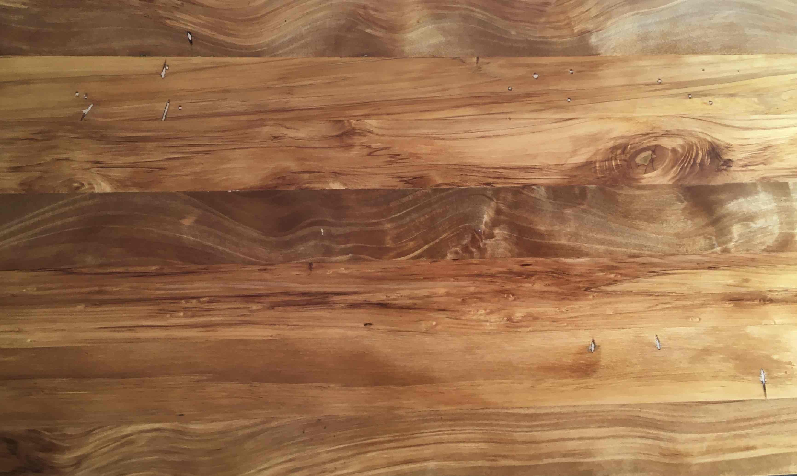
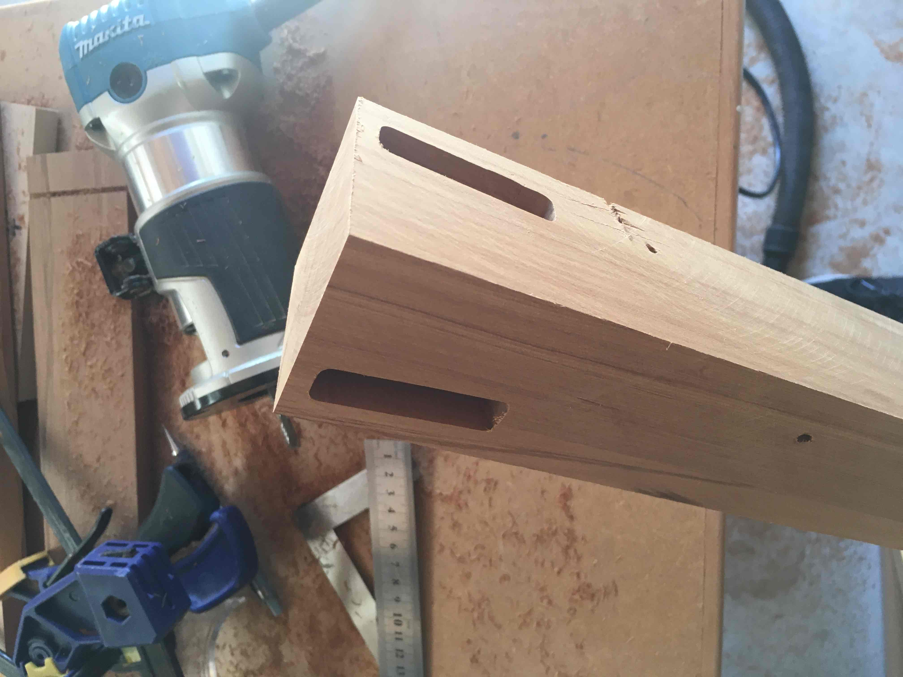
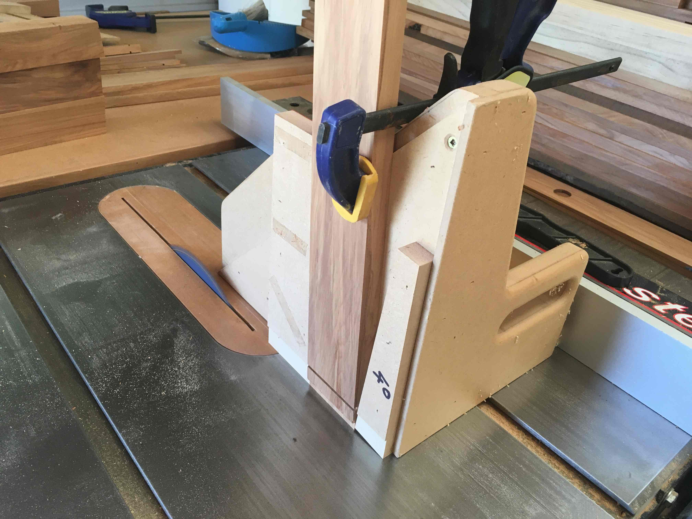
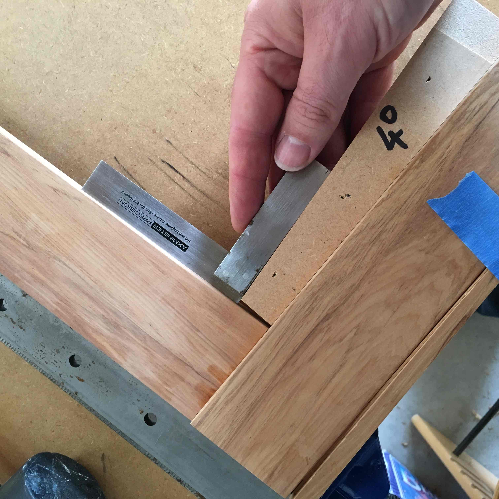
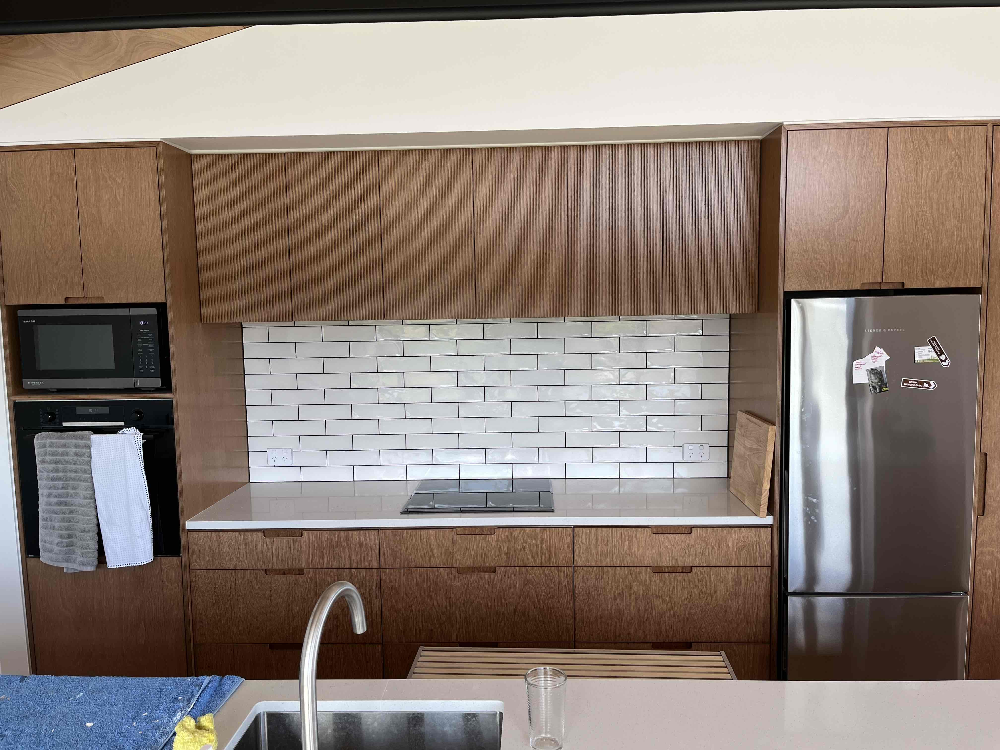
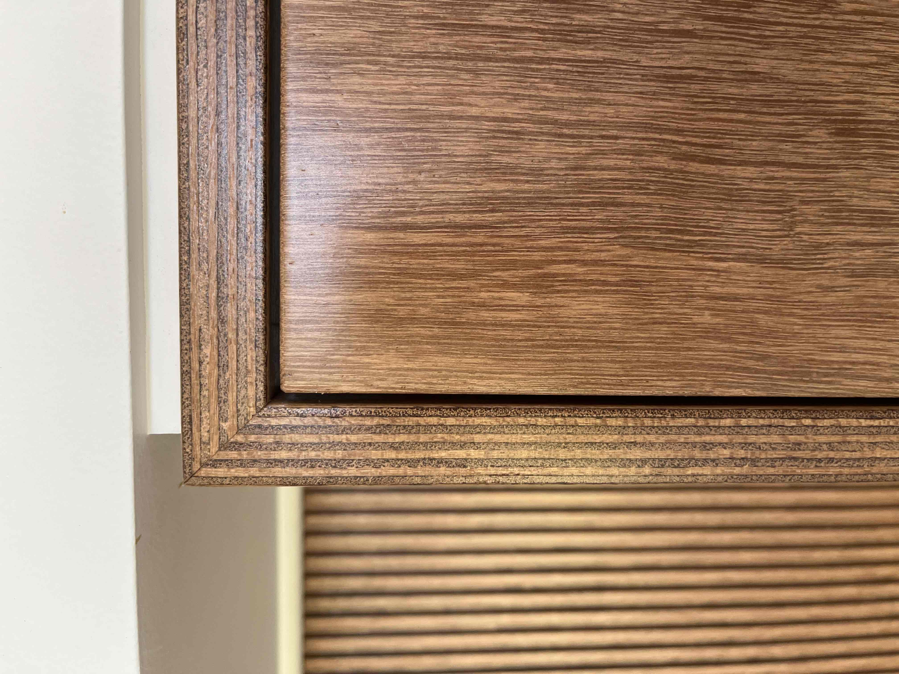

## {background-image="figures/shavings.jpg" background-opacity=0.5}

{.fragment .absolute top=150 left=0 width="720"}

{.fragment .absolute top=0 left=900 width="380"}
{.fragment .absolute bottom=0 left=340 width="600"}

{.fragment .absolute left=370 top=50 width="540"}
{.fragment .absolute left=160 top=50 width="960"}
{.fragment .absolute right=0 top=0 width="480"}

## What is a story?

```{css}
/*| echo: false */

div.sourceCode {
  font-size: 1em;
}

div.cell-output-stdout {
  font-size: 1em;
}
```

```{r}
#| echo: false

library(tidyverse)
theme_set(theme_minimal(base_size=20))

ag_production <- read_csv("https://www.massey.ac.nz/~jcmarsha/data/nz/ag_production.csv")
population <- read_csv("https://www.massey.ac.nz/~jcmarsha/data/nz/nz_population.csv")
```

[A story is a collection of facts, observations or events&nbsp;]{.fragment}[ presented in a specific order&nbsp;]{.fragment}[ such that they create an **emotional reaction**.]{.fragment}

## Every story has an arc

:::{.fragment}
Opening
:::

:::{.fragment}
Challenge
:::

:::{.fragment}
Action
:::

:::{.fragment}
Resolution
:::

:::{.fragment}
<small>Challenge and resolution are the most important parts.</small>
:::

## Wood working as a story

::: {.fragment}
**Opening:** We used to have some cheap poorly built furniture.
:::

::: {.fragment}
**Challenge:** Buying well built furniture that we like is expensive.
:::

::: {.fragment}
**Action:** I buy some ~~toys~~ tools and learn to build things out of nice timber.
:::

::: {.fragment}
**Resolution:** We still buy cheap, poorly built furniture until I get round to it.
:::

## Other story structures (the action movie)

:::{.fragment}
Action
:::

:::{.fragment}
Background
:::

:::{.fragment}
Development
:::

:::{.fragment}
Climax
:::

:::{.fragment}
Ending
:::

## Woodworking in this format

:::{.fragment}
**Action:** In 2000 I bought some ~~toys~~ tools: a router and belt sander.
:::

:::{.fragment}
**Background:** I wanted something nicer than my crappy second hand bed.
:::

:::{.fragment}
**Development:** Over the years I acquired more ~~toys~~ tools and got better at the craft, building all the things.
:::

:::{.fragment}
**Climax:** I completed our shiny new kitchen in 2025.
:::

:::{.fragment}
**Ending:** There's still lots to do: our dining table is intended for camping and the chairs are plastic.
:::


## Another story structure: Newspaper articles

:::{.fragment}
Lead
:::

:::{.fragment}
Development
:::

## Woodworking in this format

:::{.fragment}
**Lead:** Because I'm sick of poorly built furniture, I spent a bunch of money on tools and learnt to build things.
:::

:::{.fragment}
**Development:** I started simple with just a couple of tools and bought laminated panels to build a bookshelf.
:::

:::{.fragment}
But I soon realised that building with recycled native timber didn't just meet a need: it was also a new hobby with lots to learn, lots of toys to play with and lots of fun during building and enjoyment afterwards.
:::

# Telling a story with figures

## Example: Sheep numbers

```{r}
#| echo: false
#| fig-width: 10
#| fig-height: 6
#| fig-align: 'center'
base <- ag_production |>
  filter(animal == "Sheep") |>
  mutate(value = value/1e6) |>
  ggplot() +
  aes(x=year, y=value) +
  geom_line(col='royalblue', linewidth=1.5) +
  scale_y_continuous(limits=c(0,71), expand = c(0, 0.03), breaks=seq(0,70,by=10)) +
  scale_x_continuous(expand=c(0,0.05)) +
  theme_minimal(base_size=20) +
  labs(x=NULL, y="Millions of sheep") +
  theme(panel.grid.minor.y = element_blank())
base
```

:::{.fragment}
[**Challenge**: why the drop?]{.absolute right=20 top=150}
:::

## Example: Sheep numbers

```{r}
#| echo: false
#| fig-width: 10
#| fig-height: 6
#| fig-align: 'center'
base +
  geom_vline(xintercept = 1985.5, col='grey50', linewidth=4,
             alpha=0.5) +
  annotate('text', x=1985.5, y=3, label="Farmer subsidies removed", hjust=-0.03,
           col='grey50')

```

:::{.fragment}
[**Resolution**: Government reform]{.absolute right=0 bottom=200}
:::

## Example: Preprints in biology

```{r}
#| echo: false
#| fig-width: 10
#| fig-height: 6
#| fig-align: 'center'
arxiv <- read_csv(here::here("data/arxiv_submissions.csv"))
labels <- arxiv |> slice_max(date) |>
  filter(archive != "bioRxiv")
arxiv |>
  filter(archive != "bioRxiv") |>
  ggplot() +
  aes(x=date, y=count) +
  geom_line(colour = 'steelblue') +
  geom_text(data = labels, mapping=aes(label = archive), hjust=-0.1, vjust=0.5, col='steelblue') +
  scale_y_log10(limits = c(30, 1500), expand = c(0, 0.03)) +
  scale_x_date(expand=c(0,0.05)) +
  theme_minimal(base_size=20) +
  theme(plot.margin = margin(r = 2, unit="inch"),
        plot.caption = element_text(size=rel(0.6))) +
  coord_cartesian(clip='off') +
  labs(x=NULL, y="Pre-prints per month",
       caption="Data from Claus Wilke's Fundamentals of Data Visualization")
```

:::{.fragment}
[**Challenge**: why the flat line?]{.absolute right=10 bottom=150}
:::

## Example: Preprints in biology

```{r}
#| echo: false
#| fig-width: 10
#| fig-height: 6
#| fig-align: 'center'
arxiv <- read_csv(here::here("data/arxiv_submissions.csv")) |>
  filter(count > 0)
labels <- arxiv |> slice_max(date)
arxiv |>
  ggplot() +
  aes(x=date, y=count, col=archive) +
  geom_line() +
  geom_text(data = labels, mapping=aes(label = archive), hjust=-0.1, vjust=0.5) +
  scale_y_log10(limits = c(30, 1500), expand = c(0, 0.03)) +
  scale_x_date(expand=c(0,0.05)) +
  scale_colour_manual(values = c('steelblue', 'brown')) +
  guides(colour = 'none') +
  theme_minimal(base_size=20) +
  theme(plot.margin = margin(r = 2, unit="inch"),
        plot.caption = element_text(size=rel(0.6))) +
  coord_cartesian(clip='off') +
  labs(x=NULL, y="Pre-prints per month",
       caption="Data from Claus Wilke's Fundamentals of Data Visualization")
```

:::{.fragment}
[**Resolution**: A competitor emerged]{.absolute right=0 bottom=100}
:::

## Example: Egg prices

```{r}
#| echo: false
#| fig-width: 10
#| fig-height: 6
#| fig-align: 'center'
eggs <- read_csv(here::here("data/eggs.csv"))
labels <- eggs |> slice_max(month)
base <- eggs |>
  ggplot() +
  aes(x=month, y=price, col=product, group=product) +
  geom_line(col='black', linewidth=1.5) +
  geom_line(linewidth=1) +
  geom_text(data = labels, mapping=aes(label = product), hjust=-0.1, vjust=0.5) +
  scale_y_continuous(limits = c(0, 13.5), expand = c(0, 0.03), labels=scales::label_dollar()) +
  scale_x_date(expand=c(0,0.05)) +
  scale_colour_manual(values = c('black', 'gold')) +
  guides(colour = 'none') +
  theme_minimal(base_size=20) +
  theme(plot.margin = margin(r = 2, unit="inch"),
        plot.caption = element_text(size=rel(0.6))) +
  coord_cartesian(clip='off') +
  labs(x=NULL, y="Price per dozen",
       caption="Free range price scaled from 6 pack to equivalent dozen assuming two free eggs\nReproduced chart from David Hood (@thoughtfulnz.bsky.social)")
base
```

:::{.fragment}
[**Challenge**: big price jump?]{.absolute right=0 top=400}
:::

## Example: Egg prices

```{r}
#| echo: false
#| fig-width: 10
#| fig-height: 6
#| fig-align: 'center'
labels <- eggs |> slice_max(month)
base +
  geom_vline(xintercept = ymd('2023-01-01'), col='grey50', linewidth=4,
             alpha=0.5) +
  annotate('text', x=ymd('2023-01-01'), y=1, label="Battery caging banned", hjust=-0.03,
           col='grey50')

```

:::{.fragment}
[**Resolution**: why did it<br />affect free range?!?]{.absolute right=10 top=400}
:::

## Telling a story with figures

Keep in mind that

::: {.incremental}
- Every figure needs a clear purpose within the arc of the story (e.g. challenge, response).

- A complete arc is difficult with just one figure! Usually requires at least two.

- Stories work best in presentations or a series of figures in an article.

- Simpler figures are better as simple stories are easier to grasp.
:::

# Labelling

## Labelling

One of the ways we can help tell stories is with labels and annotation.

:::{.fragment}
Axis and guide labels need to be descriptive.
:::

:::{.fragment}
```{r}
#| eval: false
my_plot + labs(x = NULL, # no need for an x label for dates/years/labelled categories
               y = "My y axis scale (units)",
               colour = "Colour guide")
```
:::

:::{.fragment}
Items within guides need to be descriptive as well!
:::

:::{.fragment}
Either change in the data or use the `labels` parameter in `scale_*()`:
```{r}
#| eval: false
my_plot + scale_colour_manual(labels = c("Adelie", "Chinstrap", "Gentoo"))
```
:::


## Labelling example

:::: {.columns}

::: {.column width="50%"}
```{r gg9}
#| eval: false
ggplot(data=ag_production) +
  aes(x=year, y=value, colour=animal) +
  geom_line() +
  labs(x = "Year",
       y = "Number of animals",
       colour = "Animal")
```

The `labs()` command allows you to override the default labels.

The parameters it takes are the same as aesthetics.

:::

::: {.column width="50%"}
```{r}
#| echo: false
#| ref.label: "gg9"
```
:::

::::

## Label dictionaries

:::: {.columns}

::: {.column width="50%"}
```{r gg10}
#| eval: false

labels = c(year = "Year",
           animal = "Animal",
           value = "Number of Animals")

ggplot(data=ag_production) +
  aes(x=year, y=value, colour=animal) +
  geom_line() +
  labs(dictionary = labels)
```

A label dictionary is a named vector mapping the columns
in your data to the label you want to use.

This can be useful for consistency across multiple plots.
:::

::: {.column width="50%"}
```{r}
#| echo: false
#| ref.label: "gg10"
```
:::

::::

::: aside
Recall the `c()` function combines multiple entries into a single vector.
:::

## Titles, captions

Titles, subtitles and captions are an opportunity to provide context or story

:::{.fragment}
```{r}
#| eval: false
my_plot + labs(title = "Gap between people and sheep rapidly closing",
               subtitle = "Sheep:Human ratio over time in Aotearoa New Zealand",
               caption = "Data from Figure.NZ")
```
:::

:::{.fragment}
Adding some editorialising in figure titles is useful to help direct the reader to the key story idea.
:::

## Annotations

:::{.fragment}
`annotate()` can be used to add a single label or other geometry to a chart.
:::

:::{.fragment}
`geom_vline()` and `geom_hline()` are also useful for pointing out key points.
:::

:::{.fragment}
Both of these often require a bit of tuning to get the position correct.
:::

:::{.fragment}
```{r}
#| eval: false
plot +
  geom_vline(xintercept = ymd('2023-01-01'),
             colour='grey50', linewidth=4,
             alpha=0.5) +
  annotate('text', x=ymd('2023-01-01'), y=1,
           label="Battery caging banned", hjust=-0.03,
           colour='grey50')
```
:::

# Coordinates and scales

## Most charts use Cartesian coordinates

```{r}
#| echo: false
#| fig.width: 8
#| fig.height: 6
#| fig.align: 'center'
d <- tibble(x = c(-2,0,1), y=c(-1,0,1)) |>
  mutate(label = paste0('(',x,',',y,')'), nudge_x = if_else(x > 0, 0.1, -0.1), nudge_y = if_else(y < 0, -0.1, 0.1),
         hjust = if_else(x > 0, 0, 1), vjust = if_else(y < 0, 1, 0))
ggplot(d) +
  aes(x=x, y=y, label=label) +
  geom_point(col='royalblue') +
  geom_text(aes(nudge_x=nudge_x, nudge_y=nudge_y,
                hjust=hjust, vjust=vjust), size=15/.pt) +
  theme_minimal(base_size=20) +
  theme(panel.grid.minor = element_blank()) +
  coord_fixed(xlim=c(-3,2), ylim=c(-2,2)) +
  labs(x = 'x axis', y = 'y axis')
```

## Units don't matter in cartesian coordinates

::::{.columns}

:::{.column width="50%"}
```{r}
#| echo: false
ag_production |>
  filter(animal == "Sheep") |>
  ggplot() +
  aes(x=year, y=value) +
  geom_line(colour='royalblue') +
  labs(y = "Number of sheep") +
  theme_minimal(base_size=20)
```
:::

:::{.column width="50%"}

:::{.fragment}
```{r}
#| echo: false
sheep_chart <- ag_production |>
  filter(animal == "Sheep") |>
  mutate(value = value/1e6) |>
  ggplot() +
  aes(x=year, y=value) +
  geom_line(colour='royalblue') +
  labs(y = "Millions of sheep") +
  theme_minimal(base_size=20)
sheep_chart
```
:::

:::

::::

## Aspect ratio may not matter either

```{r}
#| echo: false
#| fig.width: 10
#| fig.height: 7
#| fig.align: 'center'
library(patchwork)
(sheep_chart + sheep_chart + plot_layout(widths=c(1,2))) / sheep_chart  & theme_minimal(base_size=16)
```

## Logarithmic scales

Some measures change **multiplicatively** rather than additively.

:::{.fragment}
You start with just two rabbits, but soon you've got 4, then 8, then 16...
:::

:::{.fragment}
There's a constant increase but it is done through multiplying.
:::

## Log scales{.smaller}

Visualising doubling: 1, 2, 4, 8, 16

::: {.fragment style="text-align: center;"}
Original data, linear scale
```{r}
#| echo: false
#| fig.height: 1
#| fig.width: 8
#| fig.align: 'center'
d <- tibble(x=2^(0:4))
ggplot(d) +
  aes(x=x) +
  geom_point(y=0, col='royalblue') +
  scale_y_continuous(limits=c(-0.1,0.1), breaks=0, labels="") +
  scale_x_continuous(limits=c(0,16)) +
  theme_minimal(base_size=16)
```
:::

::: {.r-stack}

::: {.fragment .fade-in-then-out style="text-align: center;"}
Log base 2 data, linear scale
```{r}
#| echo: false
#| fig.height: 1
#| fig.width: 8
d <- tibble(x=2^(0:4))
ggplot(d) +
  aes(x=log2(x)) +
  geom_point(y=0, col='royalblue') +
  scale_y_continuous(limits=c(-0.1,0.1), breaks=0, labels="") +
  scale_x_continuous(limits=c(0,4)) +
  theme_minimal(base_size=16) +
  labs(x = expression(log[2](x)))
```
:::

:::{.fragment style="text-align: center;"}
Log base 10 data, linear scale
```{r}
#| echo: false
#| fig.height: 1
#| fig.width: 8
d <- tibble(x=2^(0:4))
ggplot(d) +
  aes(x=log10(x)) +
  geom_point(y=0, col='royalblue') +
  scale_y_continuous(limits=c(-0.1,0.1), breaks=0, labels="") +
  scale_x_continuous(limits=c(0,log10(16))) +
  theme_minimal(base_size=16) +
  labs(x = expression(log[10](x)))
```
:::

:::

:::{.fragment style="text-align: center;"}
Original data, log scale
```{r}
#| echo: false
#| fig.height: 1
#| fig.width: 8
#| fig.align: 'center'
d <- tibble(x=2^(0:4))
ggplot(d) +
  aes(x=x) +
  geom_point(y=0, col='royalblue') +
  scale_y_continuous(limits=c(-0.1,0.1), breaks=0, labels="") +
  scale_x_log10(limits=c(1,16), breaks=c(1,2,4,8,16)) +
  theme_minimal(base_size=16)
```
:::

## Log scales

```{r}
#| echo: false
biorxiv <- arxiv |> filter(archive == "bioRxiv") |> filter(count > 0)
```

```{r}
#| fig-width: 10
#| fig-height: 6
ggplot(biorxiv) + aes(x=date, y=count) + geom_line()
```


## Log scales

```{r}
#| fig-width: 10
#| fig-height: 6
ggplot(biorxiv) + aes(x=date, y=count) + geom_line() + scale_y_log10()
```

##  Transformations

The log10 scale is implemented through the `transform` parameter of `scale_*_continuous()`.

:::{.fragment}

```{r}
#| eval: false
plot + scale_y_log10()
```

is equivalent to:

:::

:::{.fragment}
```{r}
#| eval: false
plot + scale_y_continuous(transform=scales::log10_trans())
```
:::

## Transformations

The `transform` functions provide all the details needed for the transformation:

:::{.incremental}
- The function to transform from x.
- The inverse to transform back to x.
- The breaks that should be used (or a function for them) on an axes.
- The domain that the transformation operates on.
:::

## Scale customisation

:::: {.columns}

::: {.column width="50%"}
```{r bio1}
#| eval: false
ggplot(biorxiv) +
  aes(x=date, y=count) +
  geom_line()
```

The bioRxiv example.
:::

::: {.column width="50%"}

```{r}
#| echo: false
#| ref.label: "bio1"
```
:::

::::

## Scale customisation

:::: {.columns}

::: {.column width="50%"}

```{r bio2}
#| eval: false
ggplot(biorxiv) +
  aes(x=date, y=count) +
  geom_line() +
  scale_x_date() +
  scale_y_continuous()
```

Add `scale` functions.

No change in figure as using defaults.
:::

::: {.column width="50%"}

```{r}
#| echo: false
#| ref.label: "bio2"
```
:::

::::

## Scale customisation

:::: {.columns}

::: {.column width="50%"}

```{r bio3}
#| eval: false
ggplot(biorxiv) +
  aes(x=date, y=count) +
  geom_line() +
  scale_x_date(
    name = NULL # none!
    ) +
  scale_y_continuous(
    name = "Preprints at bioRxiv"
  )
```

The `name` parameter is another
way to do `labs(x=,y=)`.
:::

::: {.column width="50%"}

```{r}
#| echo: false
#| ref.label: "bio3"
```
:::

::::

## Scale customisation

:::: {.columns}

::: {.column width="50%"}

```{r bio4}
#| eval: false
ggplot(biorxiv) +
  aes(x=date, y=count) +
  geom_line() +
  scale_x_date(
    name = NULL, # none!
    
    ) +
  scale_y_continuous(
    name = "Preprints at bioRxiv",
    limits = c(0,1600)
  )
```

The `limits` parameter changes axis limits.

Alternatives are `xlim()` and `ylim()`.
:::

::: {.column width="50%"}

```{r}
#| echo: false
#| ref.label: "bio4"
```
:::

::::

## Scale customisation

:::: {.columns}

::: {.column width="50%"}

```{r bio5}
#| eval: false
ggplot(biorxiv) +
  aes(x=date, y=count) +
  geom_line() +
  scale_x_date(
    name = NULL # none!
    ) +
  scale_y_continuous(
    name = "Preprints at bioRxiv",
    limits = c(0,1600),
    breaks = seq(0, 1600, by=400)
  )
```

The `breaks` parameter sets major breaks.

`seq(a, b, by=c)` produces a sequence
from `a` to `b` with steps of size `c`.
:::

::: {.column width="50%"}

```{r}
#| echo: false
#| ref.label: "bio5"
```
:::

::::

## Scale customisation

:::: {.columns}

::: {.column width="50%"}

```{r bio6}
#| eval: false
ggplot(biorxiv) +
  aes(x=date, y=count) +
  geom_line() +
  scale_x_date(
    name = NULL # none!
    ) +
  scale_y_continuous(
    name = "Preprints at bioRxiv",
    limits = c(0,1600),
    breaks = seq(0, 1600, by=400),
    labels = c("0/m", "400/m", "800/m",
               "1,200/m", "1,600/m")
  )
```

The `labels` parameter sets the labels for those breaks.
:::

::: {.column width="50%"}

```{r}
#| echo: false
#| ref.label: "bio6"
```
:::

::::

## Scale customisation

:::: {.columns}

::: {.column width="50%"}

```{r bio7}
#| eval: false
ggplot(biorxiv) +
  aes(x=date, y=count) +
  geom_line() +
  scale_x_date(
    name = NULL # none!
    ) +
  scale_y_continuous(
    name = "Preprints at bioRxiv",
    limits = c(0,1600),
    breaks = seq(0, 1600, by=400),
    labels = function(x) paste0(x,"/m")
  )
```

The `labels` parameter can be a function.
:::

::: {.column width="50%"}

```{r}
#| echo: false
#| ref.label: "bio7"
```
:::

::::

## Scale customisation

:::: {.columns}

::: {.column width="50%"}

```{r bio8}
#| eval: false
ggplot(biorxiv) +
  aes(x=date, y=count) +
  geom_line() +
  scale_x_date(
    name = NULL # none!
    ) +
  scale_y_continuous(
    name = "Preprints at bioRxiv",
    limits = c(0,1600),
    breaks = seq(0, 1600, by=400),
    labels = scales::label_comma(
      suffix="/m"
      )
  )
```

The `scales` package has lots of common labellers.
:::

::: {.column width="50%"}

```{r}
#| echo: false
#| ref.label: "bio8"
```
:::

::::

## Scale customisation

:::: {.columns}

::: {.column width="50%"}

```{r bio9}
#| eval: false
ggplot(biorxiv) +
  aes(x=date, y=count) +
  geom_line() +
  scale_x_date(
    name = NULL, # none!
    date_breaks = "2 years"
    ) +
  scale_y_continuous(
    name = "Preprints at bioRxiv",
    limits = c(0,1600),
    breaks = c(0, 400, 800, 1200, 1600),
    labels = scales::label_comma(
      suffix="/m"
      )
  )
```

Some scales have alternate versions of breaks.
:::

::: {.column width="50%"}

```{r}
#| echo: false
#| ref.label: "bio9"
```
:::

::::

## Polar coordinates

The **coordinate** system defaults to cartesian.

Polar coordinates are suited where data are 'circular' in some way.

:::{.incremental}
- hourly or within-day patterns

- daily or within week patterns

- yearly patterns (seasonality)

- longitude (maps!)
:::

## Solar generation in Palmerston North

```{r}
#| echo: false
solar <- read_csv(here::here("data/solar_by_day.csv")) |>
  mutate(kWh = smoothed/1e3)
```

```{r}
#| fig-width: 10
#| fig-height: 7
ggplot(solar) + aes(x=day, y=kWh) + geom_line()
```

## Solar in Palmerston North

```{r}
#| fig-width: 10
#| fig-height: 7
ggplot(solar) + aes(x=day, y=kWh) + geom_line() + coord_polar()
```

## Fixing up the `kWh` scale

```{r}
#| fig-width: 10
#| fig-height: 7
ggplot(solar) + aes(x=day, y=kWh) + geom_line() + coord_polar() +
  scale_y_continuous(limits=c(0,40))
```
